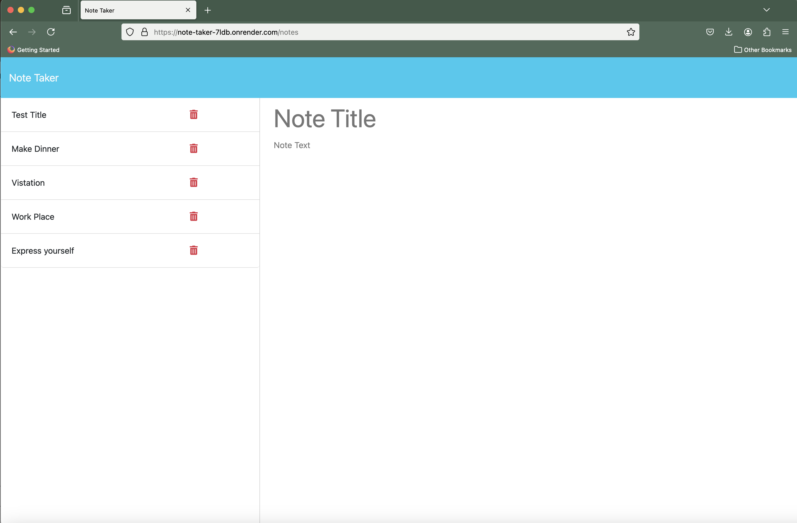

# Note-Taker


## Description
```md
Create an application called Note Taker that can be used to write and save notes. This application will use an Express.js back end and will save and retrieve note data from a JSON file.
```
## Table of Contents

- [Description](#describution)
- [Table of Contents](#table-of-contents)
- [Installation](#installation)
- [User Story](#user-story)
- [Acceptance Criteria](#acceptance-criteria)
- [Usage](#usage)

- [Authors and Contributors](#authors-and-contributors)
- [License](#license)
- [Test](#test)
- [Github Repository Link](#github-repository-link)
- [Deployed Link](#deployed-link)
- [Contact Me](#contact-me)

## Installation
```md
This Web Application will be hosted which means there is no installation required. 

```
## User Story

```md
AS A small business owner
I WANT to be able to write and save notes
SO THAT I can organize my thoughts and keep track of tasks I need to complete
```

## Acceptance Criteria

```md
GIVEN a note-taking application
WHEN I open the Note Taker
THEN I am presented with a landing page with a link to a notes page
WHEN I click on the link to the notes page
THEN I am presented with a page with existing notes listed in the left-hand column, plus empty fields to enter a new note title and the note’s text in the right-hand column
WHEN I enter a new note title and the note’s text
THEN a "Save Note" button and a "Clear Form" button appear in the navigation at the top of the page
WHEN I click on the Save button
THEN the new note I have entered is saved and appears in the left-hand column with the other existing notes and the buttons in the navigation disappear
WHEN I click on an existing note in the list in the left-hand column
THEN that note appears in the right-hand column and a "New Note" button appears in the navigation
WHEN I click on the "New Note" button in the navigation at the top of the page
THEN I am presented with empty fields to enter a new note title and the note’s text in the right-hand column and the button disappears
```

## Usage

```md
Open a browser from the device you are using and type the following link in the urls address [](https://note-taker-7ldb.onrender.com) or click on it

```
## Mock Up

The following images show the web application's appearance and functionality:

* The image below shows how the application is running

    


## Authors and Contributors

```md
This Application is designed and implemented by Jean de Dieu Habiyaremye, a 2024 bootcamp students hosted by edx partering with MSU. This application is made possible through different guidance and advice of the Professor Jung and si different Teacher Assistance of the bootcamp
```
## License

```md
This application is under the License of MIT
```

For more details Click on License Badge   

[](LICENSE)
## Github Repository Link

[Github Repository Link](https://github.com/jahdona/Note-Taker)

## Deployment Link
[Link to the deployed on render](https://note-taker-7ldb.onrender.com)

## Test

```
In order to run a test type the following comnmnand in terminal: npm test
```
## Contact Me

```md
For further details contact me through phone +1(616)-441-9202 and on my Email: jahdonah@yahoo.com
```

